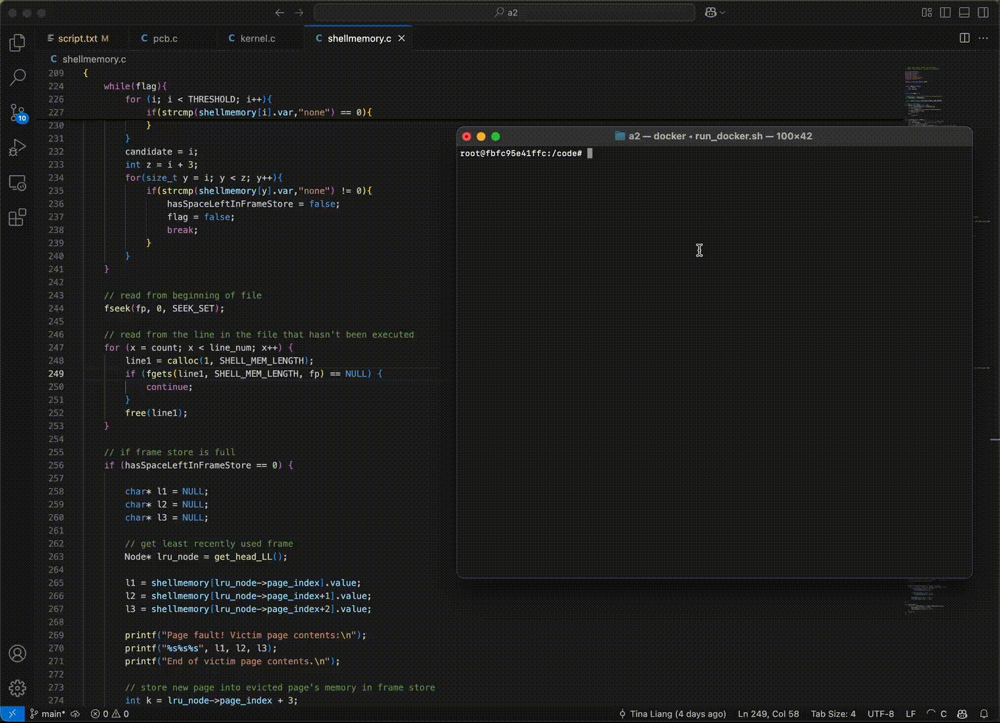

## Custom OS Shell

I built my own OS shell that has its own memory management system using the LRU (Least Recently Used) policy.
This allows programs that are larger than the shell's memory to be executed.

#### How does it work?

When we go about executing multiple programs, each program will need to load their respective information into memory. But most of the time, the shell's memory cannot hold all their collective info, which is why we have a paging system. This system is able to keep track of what info has been executed for each program, if there's space left in the memory, and what page to evict if memory is full. 

In this case, each page size is three lines long.

#### What does this project involve?

* Implementing a paging system.
  * Includes page table and PCB (process control blocks) for each program.
* Implementing a LRU queue.

#### Demo

In this demo we show a test case where a page fault occurs and the LRU policy determines what page to evict and what page frame to load into memory so the entire program is able to execute.

Here, we see that the shell memory = 6, so only two pages fit in memory. We are executing script.txt that runs prog8 which contains 8 lines of code. When the program first starts, the first two pages are loaded into memory but when we go to execute the 7th line, we can't find it! Thus we need to use the LRU queue to evict the least recently used page (in this case, the first page) and replace it with the last two lines of the program to be executed.

  

